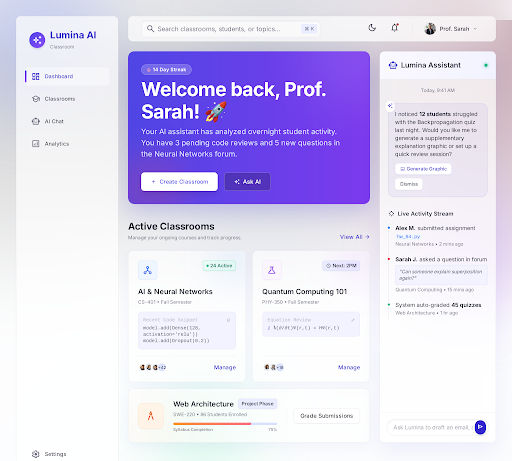

# Lumina AI Classroom — Design System & Guidelines

> **Stitch Project ID:** `14912175207854380484`  
> **Light Theme Asset:** `assets/5d074ebfcf984fbc994e42a1993737f9`  
> **Dark Theme Asset:** `assets/2e54145992fd4721b840b348dbd26218`  
> **View in Stitch:** [Stitch Project Dashboard](https://stitch.withgoogle.com)  

---

## 🌟 Concept & Brand Aesthetics

Lumina AI Classroom is built on **Glassmorphism**, **Pastel Mesh Gradients**, and **Digital Calm**. The interface bridges logic and creativity, balancing high utility for educators with an inspiring, ethereal experience for students.

- **Light Mode Atmosphere:** An open, airy studio with a soft pastel mesh background (`#f8fafc` + floating indigo/violet/rose ambient light blobs), frosted glass panels (`rgba(255,255,255,0.8)`), 1px subtle strokes, and soft ambient drop-shadows.
- **Dark Mode Atmosphere:** A deep space void (`#0a0a0f`) with floating dark glass layers, vibrant neon glow pulses (`#8B5CF6`, `#3B82F6`), and crisp high-contrast typography.

---

## 🎨 Color Palette & Tokens

### Light Theme Palette

| Role | Token / Hex | Description |
|---|---|---|
| **Base Background** | `#f8fafc` | Cool slate-white canvas |
| **Mesh Blobs** | `#7C3AED` / `#0EA5E9` / `#F43F5E` | Ambient background glow blobs |
| **Primary (Indigo)** | `#4F46E5` | Active states, primary buttons |
| **Secondary (Violet)** | `#7C3AED` | Gradient secondary accents |
| **Tertiary (Rose)** | `#F43F5E` | AI Spark badges, live status pulses |
| **Text Primary** | `#0F172A` | Crisp dark slate headlines |
| **Text Secondary** | `#64748B` | Subheadings, metadata, captions |
| **Glass Border** | `rgba(15, 23, 42, 0.08)` | Subtle card stroke |
| **Ambient Shadow** | `0 20px 50px rgba(79, 70, 229, 0.06)` | Floating glass depth |

### Dark Theme Palette

| Role | Token / Hex | Description |
|---|---|---|
| **Base Background** | `#0a0a0f` | Nocturnal canvas |
| **Primary (Purple)** | `#8B5CF6` | Primary actions & glows |
| **Secondary (Blue)** | `#3B82F6` | Links & secondary states |
| **Text Primary** | `#E4E1E9` | Crisp bright text |
| **Text Secondary** | `rgba(255, 255, 255, 0.7)` | Muted body text |
| **Glass Border** | `rgba(255, 255, 255, 0.1)` | White frosted stroke |

---

## 🖼️ Stitch Screen Previews

### 1. Light Theme Teacher Dashboard (New ✨)



**Highlights:**
- **Hero Banner:** Vibrant Indigo-to-Violet gradient card (`#4F46E5` to `#7C3AED` with rose accent) featuring *"Welcome back, Prof. Sarah! 🚀"*, active streak pill, and quick action buttons.
- **Floating Sidebar:** Detached glass rail with a gradient vertical pill indicator for active navigation.
- **Top Header:** Search bar with keyboard shortcut pill (`⌘K`), light/dark switcher, user avatar.
- **Classroom Cards:** Frosted glass panels with live student counters, status dots, and code snippet preview.
- **Right Sidebar:** Live AI Assistant insights and student activity feed.

---

### 2. Dark Theme Teacher Dashboard


---

## ✍️ Typography Scale (Inter)

| Style | Size / Line Height | Weight | Usage |
|---|---|---|---|
| `display-lg` | 48px / 56px | Bold (700) | Hero title, main page headings |
| `headline-md` | 24px / 32px | SemiBold (600) | Card titles, section headers |
| `body-lg` | 18px / 28px | Regular (400) | Lead descriptions |
| `body-md` | 16px / 24px | Regular (400) | Standard UI content |
| `label-sm` | 14px / 20px | Medium (500) | Buttons, form labels |
| `caption` | 12px / 16px | Regular (400) | Metadata, timestamp |

---

## 🧩 Glass Component Specifications

### Floating Glass Cards
```css
/* Light Glass Card */
background: rgba(255, 255, 255, 0.8);
backdrop-filter: blur(20px);
border: 1px solid rgba(15, 23, 42, 0.08);
border-radius: 24px;
box-shadow: 0 20px 50px rgba(79, 70, 229, 0.06);
```

### AI Spark Chips
```html
<span class="spark-chip">
  ✨ AI Insight: 85% Mastery in Recursion
</span>
```

### Hero Gradient Card
```css
background: linear-gradient(135deg, #4F46E5 0%, #7C3AED 50%, #D946EF 100%);
border-radius: 24px;
color: #FFFFFF;
box-shadow: 0 20px 50px rgba(124, 58, 237, 0.25);
```

---

## 📱 Responsive Layout Grid

- **Desktop (1440px+):** Fixed 280px sidebar, 40px outer margin, fluid 12-column content grid.
- **Tablet (768–1439px):** 80px icon-only sidebar, 24px gutters.
- **Mobile (<767px):** Bottom navigation sheet / glass drawer, 16px outer padding.

---

## 📦 File Inventory

```
final/
├── apps/
│   ├── web/
│   │   └── src/app/globals.css    # Lumina theme tokens & utilities
│   └── server/
├── docs/
│   ├── design.md                  # This specification document
│   └── designs/
│       ├── light_dashboard.png    # Stitch Light Theme UI output
│       └── teacher_dashboard.png  # Stitch Dark Theme UI output
```
