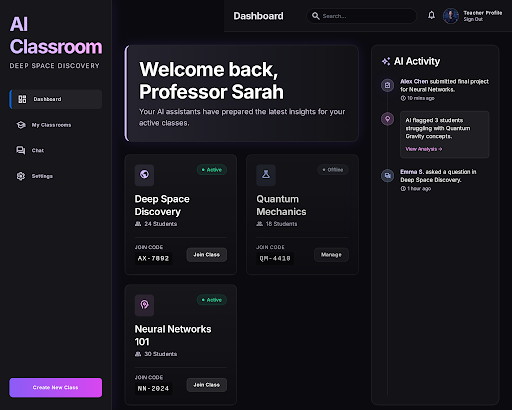

# Lumina AI Classroom — Design System

> **Stitch Project ID:** `14912175207854380484`
> **Design System Asset:** `assets/2e54145992fd4721b840b348dbd26218`
> **View in Stitch:** https://stitch.withgoogle.com

---

## Brand & Style

The design system is centered on a **Premium AI-Driven Educational** experience. It targets high-achievers and tech-forward students who value a focused, immersive environment.

The aesthetic is a refined blend of **Modern Corporate** and **Glassmorphism**. It evokes a sense of _"Deep Space Discovery"_ — utilizing a very dark, high-density background to allow content to "float" via translucent glass layers. The emotional response should be one of **calm focus, high-tech capability, and academic prestige**. High-quality typography and vibrant, neon-tinted glow effects serve as the primary indicators of AI activity and system intelligence.

---

## 🎨 Colors

| Role | Value | Usage |
|---|---|---|
| **Background** | `#0a0a0f` | Page canvas — the void |
| **Surface** | `#131318` | Cards, sidebar, panels |
| **Surface Container** | `#1f1f25` | Input fields, nested elements |
| **Primary (Violet)** | `#8B5CF6` | Primary actions, active nav, AI states |
| **Primary Gradient** | `#8B5CF6 → #D946EF` | Hero CTAs, AI response indicators |
| **Secondary (Blue)** | `#3B82F6` | Links, progress, secondary actions |
| **On-Surface** | `#e4e1e9` | Main body text |
| **On-Surface Variant** | `#cbc3d7` | Muted text, labels, captions |
| **Outline** | `rgba(255,255,255,0.1)` | Card borders, dividers |
| **Error** | `#ffb4ab` | Form errors, destructive states |

### AI Glow Accents
These are applied via `box-shadow` and `radial-gradient`:
- **Purple Glow:** `0 0 30px rgba(139, 92, 246, 0.15)` — AI suggestions, active cards
- **Blue Glow:** `0 0 20px rgba(59, 130, 246, 0.2)` — Focused inputs, links
- **Fuchsia Pulse:** `0 0 40px rgba(217, 70, 239, 0.1)` — AI typing indicators

---

## ✍️ Typography

**Font Family:** [Inter](https://fonts.google.com/specimen/Inter) — exclusively used across all text.

| Token | Size | Weight | Use |
|---|---|---|---|
| `display-lg` | 48px / 56px | 700 | Page titles, hero headings |
| `display-lg-mobile` | 32px / 40px | 700 | Mobile hero headings |
| `headline-md` | 24px / 32px | 600 | Section headers, card titles |
| `body-lg` | 18px / 28px | 400 | Primary content, descriptions |
| `body-md` | 16px / 24px | 400 | Standard UI text |
| `label-sm` | 12px / 16px | 600 | Caps labels, tags, status text |

**Rules:**
- Headlines → `#ffffff` (full white)
- Secondary text → `rgba(255,255,255,0.7)`
- Muted/disabled → `rgba(255,255,255,0.4)`
- Tighten `letter-spacing` on headings to `-0.02em` for a premium editorial feel

---

## 📐 Layout & Spacing

**Model:** Fixed Sidebar + Fluid Content Area

| Breakpoint | Sidebar | Grid | Gutters |
|---|---|---|---|
| Desktop (1440px+) | 280px docked | 12 columns | 24px |
| Tablet (768–1439px) | 80px icon rail | 8 columns | 24px |
| Mobile (<767px) | Hidden drawer | 1 column | 16px |

**Spacing Rhythm:** 8px base increments
- `stack-gap-sm`: 8px — Tight inline elements
- `stack-gap-md`: 16px — Within a card/component
- `stack-gap-lg`: 32px — Section-level separation

---

## 🪟 Elevation & Depth

Depth is achieved via **Backdrop Blurs** and **Inner Glows** — NOT traditional box-shadows.

| Level | Usage | CSS |
|---|---|---|
| **Base** | Page background | `background: #0a0a0f` |
| **Level 1** | Cards, sidebar | `background: rgba(255,255,255,0.03)` + `backdrop-filter: blur(20px)` + `border: 1px solid rgba(255,255,255,0.1)` |
| **Level 2** | Modals, dropdowns | `background: rgba(255,255,255,0.06)` + `backdrop-filter: blur(40px)` + `border: 1px solid rgba(255,255,255,0.2)` |
| **AI Active** | AI suggestions, focus | Add `box-shadow: 0 0 30px rgba(139,92,246,0.15)` purple outer glow |

---

## 🧩 Components

### Buttons
```css
/* Primary */
background: linear-gradient(135deg, #8B5CF6, #D946EF);
color: white;
border: none;
border-radius: 8px;
padding: 12px 24px;
font-weight: 600;

/* Secondary / Ghost */
background: rgba(255,255,255,0.04);
border: 1px solid rgba(255,255,255,0.1);
color: white;
border-radius: 8px;
```

### Input Fields
```css
background: rgba(0,0,0,0.3);
border: 1px solid rgba(255,255,255,0.1);
border-radius: 8px;
color: white;

/* Focus state */
border-color: #3B82F6;
box-shadow: 0 0 0 4px rgba(59,130,246,0.1);
```

### Cards
```css
background: rgba(255,255,255,0.03);
backdrop-filter: blur(20px);
border: 1px solid rgba(255,255,255,0.1);
border-radius: 16px;
/* Optional gradient border highlight at top */
background-image: linear-gradient(rgba(255,255,255,0.05), rgba(255,255,255,0));
```

### Sidebar Navigation
```css
/* Active nav item */
border-left: 3px solid #3B82F6;   /* vertical pill */
color: white;
background: rgba(59,130,246,0.08);

/* Inactive */
color: rgba(255,255,255,0.5);
```

### Activity Feed
- Thin `1px rgba(255,255,255,0.1)` vertical line connecting timeline nodes
- Circular dot indicators (12px) colored by type: green = online, gray = offline, purple = AI event

### AI Interaction Nodes
```css
/* Animated gradient border for AI-active state */
border: 1px solid transparent;
background: linear-gradient(#131318, #131318) padding-box,
            linear-gradient(135deg, #8B5CF6, #D946EF, #3B82F6) border-box;
box-shadow: 0 0 40px rgba(139, 92, 246, 0.1);
```

---

## 📱 Screens

| Screen | Status | Stitch ID |
|---|---|---|
| Teacher Dashboard | ✅ Generated | `12a946b7fc5e48f986697291d6b76265` |
| Student Dashboard | 🔲 Planned | — |
| Private Chat Room | 🔲 Planned | — |
| Chat Lobby | 🔲 Planned | — |
| Login / Register | 🔲 Planned | — |

### Teacher Dashboard Preview


**Key layout elements:**
- Left sidebar: Logo, nav links with active-state vertical pill
- Top header: Teacher name + Sign out button
- Classroom grid (3 cols): Class name, student count, join code, status dot
- Right panel: Live activity feed with AI event notifications

---

## 🔧 CSS Variables Reference

```css
:root {
  /* Surfaces */
  --background:   #0a0a0f;
  --surface:      #131318;
  --surface-low:  #1b1b20;
  --surface-mid:  #1f1f25;
  --surface-high: #2a292f;

  /* Brand */
  --primary:      #8b5cf6;
  --primary-end:  #d946ef;
  --secondary:    #3b82f6;
  --success:      #10b981;
  --danger:       #ef4444;

  /* Text */
  --text-primary:   #e4e1e9;
  --text-secondary: rgba(255,255,255,0.7);
  --text-muted:     rgba(255,255,255,0.4);

  /* Borders */
  --border:         rgba(255,255,255,0.1);
  --border-focus:   rgba(59,130,246,0.5);

  /* Glows */
  --glow-purple: 0 0 30px rgba(139, 92, 246, 0.15);
  --glow-blue:   0 0 20px rgba(59, 130, 246, 0.2);

  /* Spacing */
  --sidebar-width: 280px;
  --gutter: 24px;
  --radius: 8px;
  --radius-lg: 16px;
}
```

---

## 📦 Project Structure

```
final/
├── apps/
│   ├── web/                    # Next.js 16 frontend
│   │   └── src/
│   │       ├── app/            # Pages and routing
│   │       ├── components/     # Reusable UI components
│   │       ├── hooks/          # React hooks (useAuth, etc.)
│   │       └── lib/            # API client, socket service
│   └── server/                 # Express + Socket.IO backend
│       └── src/
│           ├── modules/        # Feature modules (auth, chat, classrooms)
│           ├── socket/         # Real-time event handlers
│           ├── middleware/      # Auth, error handling
│           └── db/             # Migrations
├── extensions/
│   └── vscode-classroom/       # VS Code extension
├── packages/                   # Shared utilities
├── docs/
│   ├── design.md               # This file — design system
│   └── designs/                # Stitch-generated screen PNGs
├── docker-compose.yml
├── docker-compose.prod.yml
└── .gitignore
```

---

*Generated with [Google Stitch](https://stitch.withgoogle.com) · Design System: **Lumina AI Classroom***
